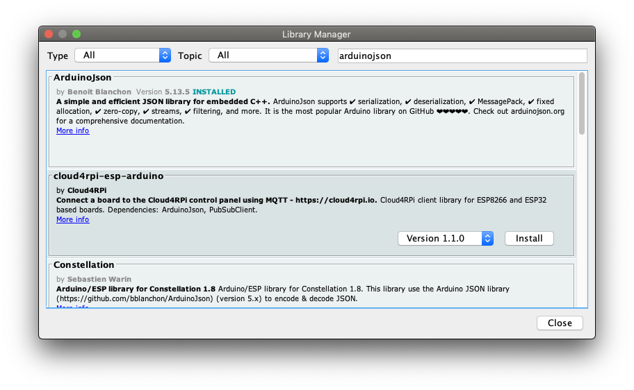

# Arduino JSON WebServer

## Getting Started

Open `Ethernet-example-json.ino` in Arduino IDE.

Install `ArduinoJson` Library version `5.13.5`

`Tools` -> `Manage Libraries...` -> search for `arduinojson`, then select Version 5.13.5 from the dropdown:

Make up a MAC address if using more than one arduino on the same network:

    byte mac[] = { 0xDE, 0xAD, 0xBD, 0xEF, 0xFE, 0xED };

Change the IP Address to one in your local network:

    IPAddress ip(192,168,86,183);

Upload the Sketch to your board.

You can now access either through a browser at: [http://192.168.86.183](http://192.168.86.183) (this IP will be different if you changed it per the code above).  

Or access through terminal/powershell:

    $ curl http://192.168.86.183
    {
      "software_version": "1.0.1",
      "sensor_readings": {
        "0": 496,
        "1": 441,
        "2": 443,
        "3": 468,
        "4": 394,
        "5": 357
      }
    }
